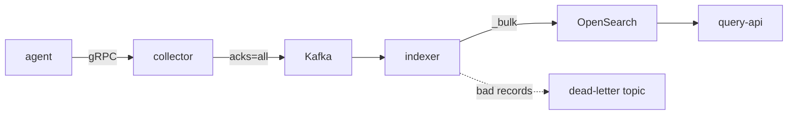
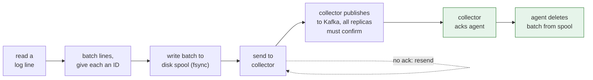
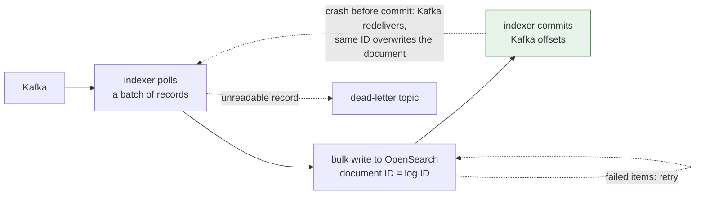

# log-plat

A log pipeline in Go. Agents tail log files and send them to a collector over gRPC. The collector writes to Kafka, an indexer moves the logs from Kafka into OpenSearch, and a small REST API lets you search them.

The goal was to never lose a log line, even when something crashes mid-stream. Every hop is allowed to retry and send duplicates. OpenSearch throws the duplicates away because each document's ID comes from the line's position in its file. To check that this works, a separate tool reads the original file and confirms every line made it into OpenSearch.

## How it fits together



Every service also exposes Prometheus metrics, and there's a Grafana dashboard for them.

The pipeline has two handoffs where a crash could lose data. Each one has a rule about when the sender may forget a batch.

**Getting a line into Kafka.** The agent writes each batch to disk before sending it, and deletes the batch only after the collector acks it. The collector acks only after Kafka has confirmed the write.



**Getting it into OpenSearch.** The indexer saves its place in Kafka only after OpenSearch has accepted the writes. If it crashes first, Kafka hands the same records over again, and the same document IDs overwrite the earlier copies.



In both diagrams, the green boxes are the points where the sender is finally allowed to let go of a batch.

| Component | What it does |
|---|---|
| `agent` | Tails files that match your globs. Each line gets an ID built from its file position. Batches go to a disk spool before they're sent. If the collector is down, the agent reconnects with exponential backoff and jitter. |
| `collector` | gRPC server. Checks the API key, stamps the key's service name on every entry, and rejects invalid entries. Publishes to Kafka, partitioned by service. |
| `indexer` | Kafka consumer group. Bulk-indexes into daily indices, retries failed items, and sends records it can't parse to a dead-letter topic. |
| `query-api` | `GET /v1/logs` with filters for time range, service, level, and text. Uses cursor pagination, returns structured errors, and has `/healthz` and `/readyz`. |
| `loggen` | Replays a log file into another file at a rate you choose, so the agent has something to tail. |
| `zerolosscheck` | Works out the ID of every line in the source file and checks that each one is in OpenSearch. |

If you want the reasoning behind these choices, especially the delivery guarantees, idempotency, and offset handling, it's in [docs/design.md](docs/design.md).

## Try it

You need Docker with Compose v2, Go 1.27 or later, and `make`. All the images run on both amd64 and arm64, so Apple Silicon is fine.

```bash
make up            # build and start Kafka (KRaft), OpenSearch, Redis, Prometheus, Grafana, and the services
make data          # download Loghub HDFS_v1 (187 MB zip, 11.2M lines) into data/loghub/
make e2e           # replay 100,000 lines through the stack and run the zero-loss checker
```

`make e2e` prints whether anything was lost and saves the raw output to `results/`. You can change the run with `LINES` and `RATE`, for example `make e2e LINES=1000000 RATE=20000`. `RATE=0` writes as fast as it can. If you want a smaller dataset, run `make data DATASET=apache`, then `INPUT=data/loghub/Apache.log make e2e`.

To search what you've indexed:

```bash
curl -s -H 'X-API-Key: dev-query-key' \
  'localhost:8080/v1/logs?service=hdfs&level=warn&q=addStoredBlock&from=2008-11-09T00:00:00Z&to=2008-11-11T00:00:00Z&limit=20'
```

For the next page, pass the response's `next_cursor` back as `cursor=` and keep the same filters. The API keys above are local defaults from `compose.yaml`. To change them, set `COLLECTOR_API_KEYS`, `AGENT_API_KEY`, and `QUERY_API_KEYS`.

| Endpoint | URL |
|---|---|
| Query API | http://localhost:8080 |
| Grafana (dashboard "Log Platform Pipeline") | http://localhost:3000 |
| Prometheus | http://localhost:9090 |
| OpenSearch | http://localhost:9200 |
| Collector gRPC | localhost:7070 |
| Collector metrics | http://localhost:9101/metrics |
| Indexer metrics | http://localhost:9102/metrics |
| Agent metrics | http://localhost:9103/metrics |
| Kafka (from the host) | localhost:9094 |

`make down` stops everything and deletes the volumes.

## Limits and caching

Redis does two jobs, and both are off until you set them.

- **Collector.** `COLLECTOR_RATE_LIMIT` caps entries per second for each service. A service over its cap is slowed, not dropped, so its agent waits and keeps its spooled batches. In a test with a cap of 5,000/s, 100,000 lines took 19 s with zero lost.
- **Query API.** `QUERY_RATE_LIMIT` allows each API key that many requests per second and answers `429` with `Retry-After` beyond it. `QUERY_CACHE_TTL` caches search results, so repeating a search returns `X-Cache: HIT`. A cached page can be up to the TTL old.

Compose turns on the query limit (50/s) and the 30 s cache, and leaves the collector unlimited so replay benchmarks stay meaningful. If Redis goes down, requests go through unlimited and uncached. Details and the trade-offs are in [docs/design.md](docs/design.md).

## Break it on purpose

The chaos tests check the "never lose a line" claim by hurting the pipeline while it runs. Each of the 17 scenarios writes a 60,000-line file, injects a fault partway through, heals it, and then runs the zero-loss checker. The faults include SIGKILLing the collector, Kafka, the indexer, the agent, and OpenSearch, cutting or slowing each network link with Toxiproxy, and crash loops. Two scenarios force duplicate deliveries, and the test fails unless OpenSearch absorbed some.

```bash
make chaos-up      # same stack as `make up`, with Toxiproxy between the services
make chaos         # takes about 9 minutes; saves raw output and a JSON report per scenario to results/chaos/
make chaos-down
```

All 17 passed with zero lines lost, in three full runs. The last one used the Phase 4 indexer default of 4 parallel bulk writers. The table, the runs behind it, and what the tests don't cover are in [results/README.md](results/README.md) and [docs/design.md](docs/design.md). The chaos tests are not part of CI because they need the full stack and take several minutes.

## Working on it

```bash
make test-unit          # unit tests with -race
make test-integration   # real Kafka and OpenSearch in testcontainers; needs Docker
make lint               # golangci-lint and buf lint
make bench              # microbenchmarks, saved to results/
make proto              # regenerate gen/ from proto/
make ci                 # run the GitHub Actions workflow locally with act
```

Where things live:

- `cmd/` has one binary per directory.
- `internal/` has the logic. The main packages are `agent`, `spool`, `collector`, `indexer`, `query`, `zeroloss`, and `loggen`. The rest are shared helpers.
- `integration/` has end-to-end tests against real Kafka and OpenSearch.
- `chaos/` has the fault-injection tests that drive the running stack.
- `proto/` is the gRPC contract, and `gen/` is the Go code generated from it.
- `deploy/` has the Prometheus and Grafana config.
- `results/` has raw output from benchmark and replay runs.
- `docs/` has the design notes.

Every service reads its config from environment variables. Each `cmd/*/main.go` lists the ones it uses and their defaults.

## Benchmark results

All measured on one MacBook (10 CPUs), with the load generators on the same machine. The commands, raw output, and every caveat are in [results/README.md](results/README.md).

| Measurement | Result |
|---|---|
| Ingest at full speed, default settings | about 70,000 lines/s (median of 13 runs, range 61,713 to 77,622), zero lost |
| Ingest before parallel bulk writes | about 40,000 lines/s (5 runs) |
| End-to-end latency at 5,000 to 40,000 lines/s | p50 20 to 117 ms, p99 154 to 450 ms |
| Latency once offered load reaches capacity (60,000 lines/s) | p50 637 ms, p99 1.6 s, with a wide spread |
| Repeated search, cache on against off | p50 0.37 ms against 8.7 ms at one client (about 22x the throughput) |
| Search that never repeats | the cache does not help |

"End-to-end" means the agent reading a line to the indexer starting its write. A line is searchable up to 5 s later, after OpenSearch refreshes.

```bash
make bench-up                                  # the stack with the benchmark overlay
make bench-capacity                            # compare indexer and shard settings, 5 rounds
make bench-sweep                               # latency at fixed offered loads, 5 rounds
```

Query benchmarks are `scripts/gen_query_targets.py` and `scripts/bench-query.sh`, described in the results README.

## What's next

1. **Core pipeline (done).** Agent, collector, Kafka, indexer, query API, loggen, zero-loss checker, tests, and CI.
2. **Chaos tests (done).** Kill the collector, Kafka, and the indexer mid-stream, break the network with Toxiproxy, and check that nothing is lost.
3. **Redis (done).** Cache repeated queries, and rate-limit each API key with a token bucket at both the collector and the query API.
4. **Benchmarks (done).** Measure ingest logs per second, end-to-end latency (p50 and p99), and query latency.
5. **Live tail and alerts.** Stream logs over WebSockets or SSE, send error-spike alerts to Slack, and ingest logs from the OpenTelemetry demo app.
6. **Deployment.** A Helm chart tested on kind, then self-managed EC2 on AWS, with a teardown script and billing alerts.
