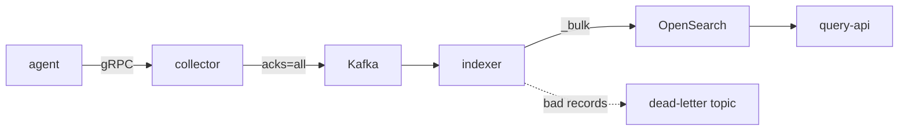
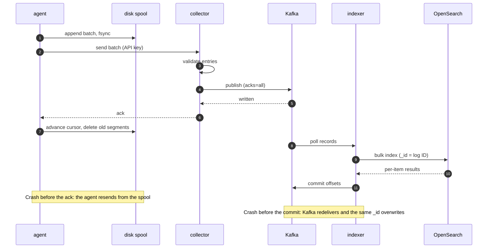

# log-plat

A distributed log platform written in Go. Agents tail log files and stream them over gRPC to a collector. The collector publishes to Kafka, an indexer writes to OpenSearch, and a REST API serves search. Each hop delivers at least once, and OpenSearch deduplicates by log ID, so every line is stored exactly once even when components crash and retry. A zero-loss checker verifies this by comparing the IDs in the source file against the IDs in OpenSearch.

## Architecture



Each service also exposes Prometheus metrics, and Grafana charts them.

### Life of one batch

The agent deletes a batch only after the collector acks it, and the collector acks only after Kafka does. The indexer commits Kafka offsets only after OpenSearch accepts the writes.



| Hop | Proceeds only after | If it fails |
|---|---|---|
| agent to collector | The collector acks, which means Kafka confirmed | The agent resends from its spool |
| collector to Kafka | All in-sync replicas ack | The stream closes and the agent retries |
| indexer to OpenSearch | The bulk write succeeds | Kafka redelivers, and the same ID overwrites |

| Component | What it does |
|---|---|
| `agent` | Tails files matching globs. It gives each line a deterministic ID derived from its file position, batches lines, and fsyncs each batch to a disk spool before sending it. It deletes a batch only after the collector acks it. It reconnects with exponential backoff and full jitter. |
| `collector` | gRPC server. It authenticates API keys, stamps the key's service on each entry, and validates entries. It publishes to Kafka partitioned by service, and acks the agent only after Kafka acks. |
| `indexer` | Kafka consumer group. It bulk-indexes into daily indices using the log ID as the document `_id`, retries transient failures per item, and dead-letters bad records. It commits offsets only after the writes succeed. |
| `query-api` | `GET /v1/logs` with time range, service, level, and full-text filters. It uses cursor (keyset) pagination, returns structured errors, and serves `/healthz` and `/readyz`. |
| `loggen` | Replays a log file into another file at a configurable rate, for the agent to tail. |
| `zerolosscheck` | Recomputes every expected ID from the source file and verifies each one is in OpenSearch. |

[docs/design.md](docs/design.md) explains the reasoning behind each design choice, especially delivery guarantees, idempotency, and offset handling.

## Quick start

You need Docker with Compose v2, Go 1.27 or later, and `make`. Every image runs on both amd64 and arm64 (Apple Silicon).

```bash
make up            # build and start Kafka (KRaft), OpenSearch, Redis, Prometheus, Grafana, and the services
make data          # download Loghub HDFS_v1 (187 MB zip, 11.2M lines) into data/loghub/
make e2e           # replay 100,000 lines through the stack and run the zero-loss checker
```

`make e2e` prints the checker's verdict and saves the raw output to `results/`. Set `LINES` and `RATE` to change the run, for example `make e2e LINES=1000000 RATE=20000`. `RATE=0` writes as fast as possible. For the smaller Apache dataset, run `make data DATASET=apache` and then `INPUT=data/loghub/Apache.log make e2e`.

Search the indexed logs:

```bash
curl -s -H 'X-API-Key: dev-query-key' \
  'localhost:8080/v1/logs?service=hdfs&level=warn&q=addStoredBlock&from=2008-11-09T00:00:00Z&to=2008-11-11T00:00:00Z&limit=20'
```

To get the next page, pass the response's `next_cursor` back as `cursor=` with the same filters. The keys above are local development defaults set in `compose.yaml`. Override them with the `COLLECTOR_API_KEYS`, `AGENT_API_KEY`, and `QUERY_API_KEYS` environment variables.

| Endpoint | URL |
|---|---|
| Query API | http://localhost:8080 |
| Grafana (dashboard "Log Platform Pipeline") | http://localhost:3000 |
| Prometheus | http://localhost:9090 |
| OpenSearch | http://localhost:9200 |
| Collector gRPC | localhost:7070 |
| Collector metrics | http://localhost:9101/metrics |
| Indexer metrics | http://localhost:9102/metrics |
| Agent metrics | http://localhost:9103/metrics |
| Kafka (from the host) | localhost:9094 |

`make down` stops everything and deletes the volumes.

## Development

```bash
make test-unit          # unit tests with -race
make test-integration   # Kafka and OpenSearch in testcontainers; needs Docker
make lint               # golangci-lint and buf lint
make bench              # microbenchmarks; output saved to results/
make proto              # regenerate gen/ from proto/
make ci                 # run the GitHub Actions workflow locally with act
```

Layout:

- `cmd/`: one binary per directory.
- `internal/`: all logic. `agent`, `spool`, `collector`, `indexer`, `query`, `zeroloss`, and `loggen` are the main packages. The rest are shared helpers.
- `integration/`: end-to-end tests against real Kafka and OpenSearch.
- `proto/`: the protobuf contract. `gen/` holds the generated Go code.
- `deploy/`: Prometheus and Grafana configuration.
- `results/`: raw benchmark and replay output.
- `docs/`: design notes.

Configuration comes from environment variables. Each `cmd/*/main.go` lists the variables it reads, with their defaults.

## Benchmark results

Phase 4 fills in this section. Until then, [results/](results/) holds the raw output of the Phase 1 zero-loss replays.

## Roadmap

1. **Core pipeline (done).** The agent, collector, Kafka, indexer, query API, loggen, zero-loss checker, tests, and CI.
2. **Chaos tests.** Kill the collector, Kafka, and the indexer mid-stream, inject network faults with Toxiproxy, and verify zero loss.
3. **Redis.** Cache repeated queries, and add token-bucket rate limiting per API key at the collector and the query API.
4. **Benchmarks.** Measure ingest logs/sec, end-to-end latency (p50 and p99), and query latency.
5. **Live tail and alerts.** Stream logs over WebSockets or SSE, send error-spike alerts to Slack, and ingest logs from the OpenTelemetry demo app.
6. **Deployment.** A Helm chart tested on kind, then self-managed EC2 on AWS, with a teardown script and billing alerts.
